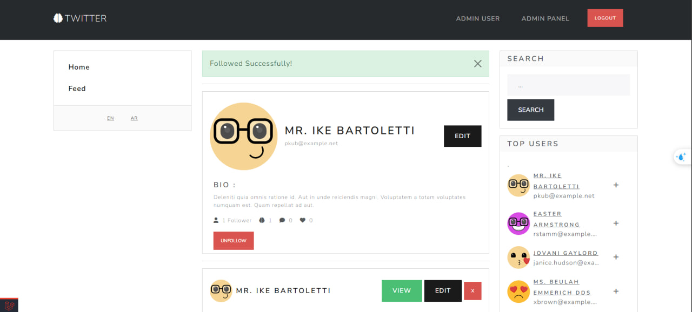
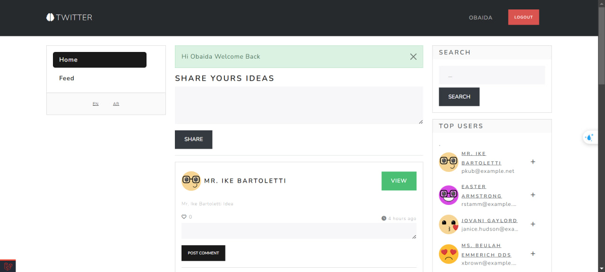
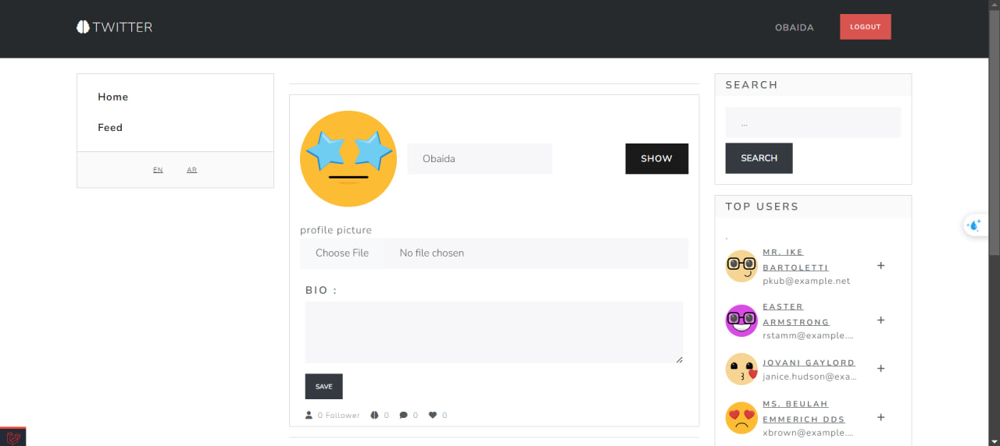

<p align="center"><a href="https://laravel.com" target="_blank"></a></p>

<p align="center">
<a href="https://github.com/laravel/framework/actions"></a>
<a href="https://packagist.org/packages/laravel/framework"></a>
<a href="https://packagist.org/packages/laravel/framework"></a>
<a href="https://packagist.org/packages/laravel/framework"></a>
</p>

# Twitter Clone

## Project Description

This project is **Twitter Clone**, and it aims to provide an approximate version of the **Twitter** social media platform, where users can share their thoughts and interact with others' posts. The project allows users to create accounts, follow other users, and post short thoughts that can be commented on and liked by others. It also includes a follow system that displays posts from only the people the user follows in their "Feed" page.

The project is built using the **Laravel Framework**, which structures the web application to be powerful and easy to use. It features an authentication system for users with advanced administrative privileges (Admins) who can manage users, posts, and comments. Additionally, users can modify their profile data, including uploading a profile picture.

## Features

-   **Robust Authentication System**:  
    The project includes an authentication system that allows users to create accounts and log in using their email and password.
-   **Post and Profile Editing Restrictions**:  
    Users are restricted from editing or modifying posts made by other users, as well as editing their own profile details unless they are the owner of the account. Only admins have the ability to edit any user's post or profile. This ensures the security and integrity of user-generated content and personal information.

-   **Admin Panel for User Management**:  
    The admin has access to a control panel to manage users, where they can view all users, modify their details, and delete accounts. The admin can also manage posts and comments from all users.

-   **Post Ideas**:  
    Users can write their thoughts and share them with their followers. These posts consist of text only, and users cannot add images to the posts.

-   **Comment on Ideas**:  
    Users can comment on ideas that others post, promoting interaction between users.

-   **Follow System**:  
    Users can follow each other, and only posts from the people they follow will appear in their "Feed."
-   **Likes System**:  
    Users can like ideas posted by others. Clicking the like button records the like in the database and can be tracked.
-   **User-specific Feed Page**:  
    The "Feed" page contains posts from the users the person follows, allowing them to stay updated with ideas from accounts they are interested in. Users can also like the posts in the Feed and interact with them.

-   **Profile Picture Upload and Editing**:  
    Users can upload a profile picture to their account, with the ability to modify it at any time.

-   **Full Admin Control**:  
     The admin has full control over all aspects of the application, including managing users, posts, comments, and likes.

-   **Interactive User Interface**:  
    The site features an interactive and clean user interface that makes it easy for users to navigate between pages and different functions.

-   **Future Feature Support**:  
    The system is designed to allow for future features such as private messaging between users, report management, and additional interaction options like custom reactions (Reactions).

## Requirements

-   PHP >= 7.3
-   Composer
-   MySQL or any other supported database

## Installation

Follow these steps to install and run the project on your local machine:

1. **Clone the Project:**
    - Clone the project using the following command:
    ```bash
    git clone https://github.com/username/project-name.git
    cd project-name
    ```
2. **Install Composer Packages**:
    - Make sure you are inside the project folder, then install the required packages using Composer:
    ```bash
     composer install
    ```
3. **Set up the Environment: Copy the .env.example file to .env:**

    ```bash
    cp .env.example .env

    ```

4. **Generate the Application Key: You need to generate the application key with this command:**

    ```bash
    php artisan key:generate

    ```

5. **Set up the Database:**:

    - Make sure the database is set up in the .env file under the database connection settings:

    ```bash
    DB_CONNECTION=mysql
    DB_HOST=127.0.0.1
    DB_PORT=3306
    DB_DATABASE=your_database_name
    DB_USERNAME=your_database_user
    DB_PASSWORD=your_database_password

    ```

6. **Run Migrations: To update the database using migrations:**

    ```bash
    php artisan migrate:refresh --seed

    ```

7. **Run the command to create a symbolic link:**

    ```bash
    php artisan storage:link

    ```

8. **Run the Server:**
    ```bash
    php artisan ser
    ```
## Usage

After setting up and running the server, open your browser and navigate to `http://localhost:8000`. From there, you can:

- Register as a new user.
- Log in to view the feed.
- Follow other users to see their posts in your feed.
- Post your thoughts and interact with others.
  
### Admin Access

To explore the admin capabilities, you can log in with the following credentials:
- **Email**: `admin@example.com`
- **Password**: `obaida1234@`

Once logged in as an admin, you will have access to:
- Managing users (viewing, editing, and deleting accounts).
- Moderating posts and comments.
- Admin-specific functionalities available in the admin control panel.

## Screenshots





## Contact
For support or inquiries, feel free to contact the project maintainer at:

- Email: obaidamire755@gmail.com
- Linkedin: www.linkedin.com/in/obaida-mire-a152a1256
